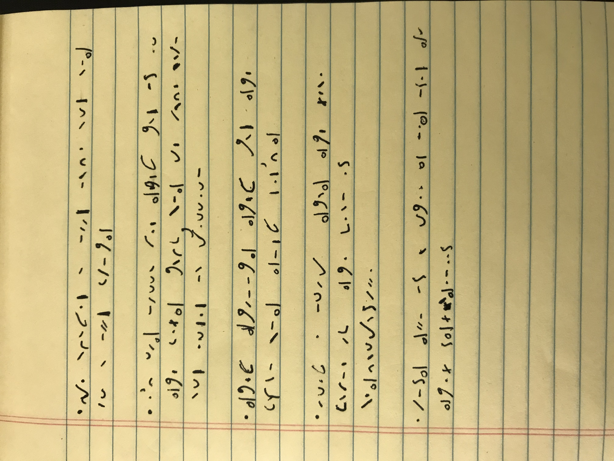

# SwampCTF 2019 - Communique<br>
**CTF Name:** SwampCTF 2019 </br>
**Challenge Name:** Communique</br>
**Challenge Description:**</br></br>
We've retrieved the message from the courier! The damn thing was stuck in this pit! Man...if only we'd had another day to get the supplies to them they might have made it through the hot zone. In any case, the document is concise and short; hand it in when you've decoded it.

-= Created by v0ldemort =-</br></br>
**Challenge Category:** Crypto</br>
**Challenge Points:** 498</br>
**Solve:**</br>
The image is confusing at first hand, and seems like some very sloppy handwriting.



Reading the description, we see hints like "pit! Man..." and "short; hand"</br>
This indicates to us that the mysteriously encoded image might have something to do with Pit man and/or Short hand.
A simple google search returns a thing called Pitman Shorthand, and decoding it lets us get the flag (with some process of elimination)


flag = ```flag{pitmanwascool}```
