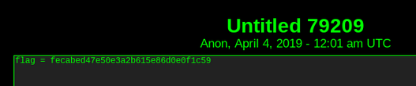
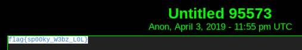

# SwampCTF 2019 - NIT<br>
**CTF Name:** SwampCTF 2019 </br>
**Challenge Name:** NIT</br>
**Challenge Description:**</br></br>
The network investigative technique had just triggered and we were starting receive telemetry when, suddenly, a pop-up asked him for administrative access. He freaked out and yanked his cable leaving us with a copious amount of line noise. We've been tracking this guy for a while and really need a win here.

See if you can get anything out of this mess:

A7]^gF*(u(BkVO)1MV#U/oPWADf.4LBQ&)IE+j2TD.GLe2e4XS@q%-(3+b!&3+=g#AMcDXAMuMZ@:V/M2e4jY

-= Created by v0ldemort =-</br></br>
**Challenge Category:** Misc</br>
**Challenge Points:** 128</br>
**Solve:**</br>
After testing the string with different base encodings, it is evidentlly Base85. Once decoded, it translates to a link.</br>
```
depastedihrn3jtw.onion/show.php?md5=7d1ecb0f8f428b70e49de68ead337d7e
```
Going to the link we see

This is an MD5 hash, which coincidentlly the website hosting the paste uses to find other posts.
Putting this hash on to the URL returns a post with the flag



flag = ```flag{sp00ky_W3bz_L0L}```
