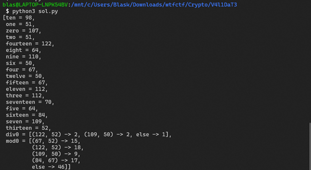

### Z3 problem
Realized through reversing that we are limited to the characters that are places in str 1 which are `CmpFny4T@1d`.  
Saw that the rest is just conditionals so I just decided to write a script to account for all the variables and then I kept getting errors so I just increased the range to be pretty big.
 

It accounted for the numbers where it may be off but basically the script worked.  
The original output was `k33pC@2m@nbp24zCTF` but doing some cross referencing with the original string that hinted at the characters to unscramble I figured that the 1 was mistaken for the 2, the y for the z, and the d for the b. 

Flag was then `wtfCTF{k33pC@1m@ndp14yCTF}`
