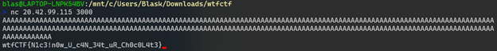

This was a basic buffer overflow. I just piped in a boatload of A's and got it to crash. This is clear since `gets()` is used in C, which is the function commonly associated with this vulnerability.

