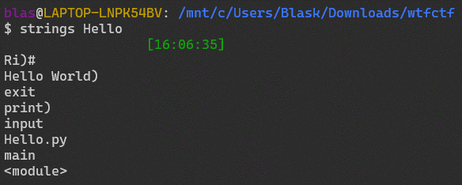
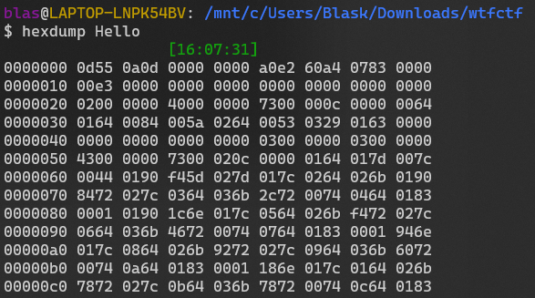
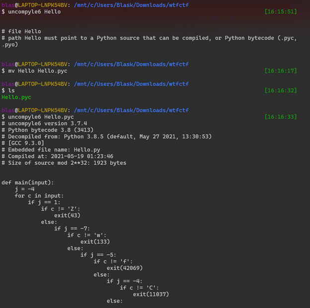

First ran file, saw it was raw bytes so then I ran strings and saw there was a Hello.py in there  
 
 

This indicated I needed to maybe get the file from within it. Did not know how to proceed so I googled the first few bytes of the file to see if it returned any hits. 
 
  

It did, I came across [this](https://reverseengineering.stackexchange.com/questions/24835/decompiling-pyc-file-to-0-byte-py-file)

It recommended I use the tool uncompyle6. I pip installed and then tried passing the file through. Changed the file to a .pyc so that way the program would understand it.  
 
  

Once decompiled I piped the output into it’s own python script. Here is the code returned  

```python
def main(input):
    j = -4
    for c in input:
        if j == 1:
            if c != 'Z':
                exit(43)
            else:
                if j == -7:
                    if c != 'w':
                        exit(133)
                    else:
                        if j == -5:
                            if c != 'f':
                                exit(42069)
                            else:
                                if j == -4:
                                    if c != 'C':
                                        exit(11037)
                                else:
                                    if j == 7:
                                        if c != 'R':
                                            exit(9001)
                                        else:
                                            if j == -2:
                                                if c != 'F':
                                                    exit(11037)
                                            if j == -1 and c != '{':
                                                exit(11037)
                                    if j == 4 and c != '3':
                                        exit(11037)
                        elif j == 0 and c != '3':
                            exit(11037)
                else:
                    if j == -3:
                        if c != 'T':
                            exit(82)
                        if j == 2:
                            if c != '_':
                                exit(11037)
                        if j == -6:
                            if c != 't':
                                exit(133)
                        if j == 6:
                            if c != 'E':
                                exit(133)
                    elif j == 9 and c != '3':
                        exit(7223)
        else:
            if j == 3:
                if c != 'R':
                    exit(133)
                if j == 5:
                    if c != 'V':
                        exit(133)
                if j == 8:
                    if c != '5':
                        exit(6738)
            elif j == 10:
                if c != '}':
                    exit(1111)
            j += 1
    else:
        print('Hello World')
```

Basically it would check the values of input and then traverse the conditions until the string matched. I was quickly able to notice that just following the values of j from -7 to 10 would resolve to be the flag so I quickly manually wrote down the values to come up with the flag.  
-7 = w  
-6 = t  
-5 = f  
-4 = C  
-3 = T  
-2 = F  
-1 = {  
0  = 3  
1  = Z  
2  = _  
3  = R  
4  = 3  
5  = V  
6  = E  
7  = R  
8  = 5  
9  = 3  
10 = }  

`flag = wtfCTF{3Z_R3VER53}`
